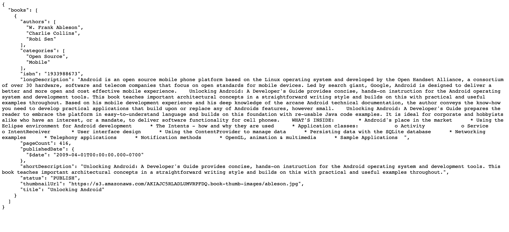

- Creating restful API for retriving book information from given dataset


# Results

Idea is to write a query i.e "Book ID" and API provides all given information related to book.


# Use command to run app

```bash

python3 run app.py
```

### Output from api for list of information created


### Output for json data file


