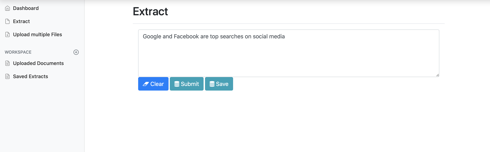
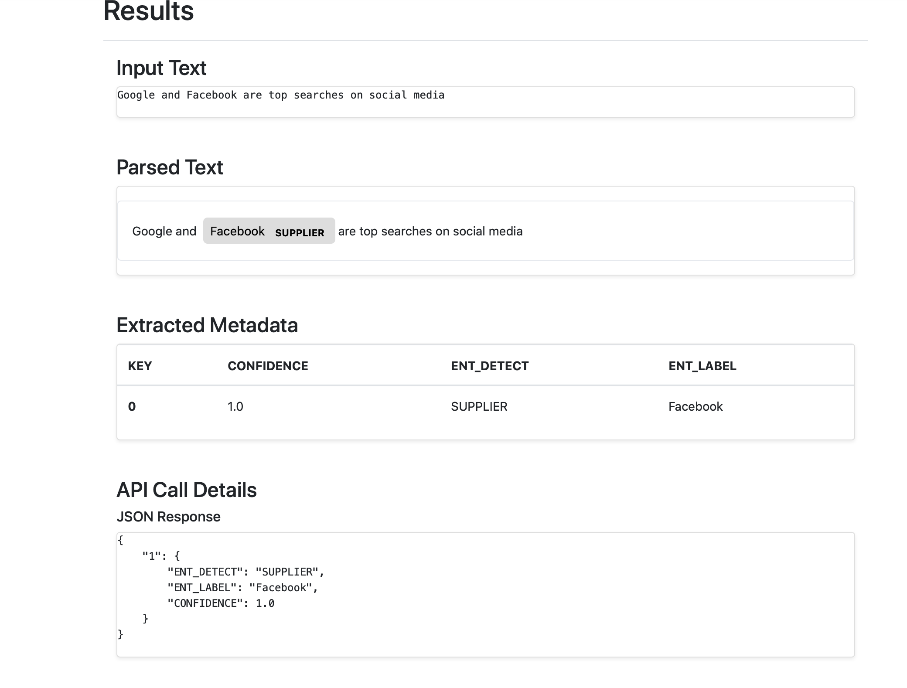
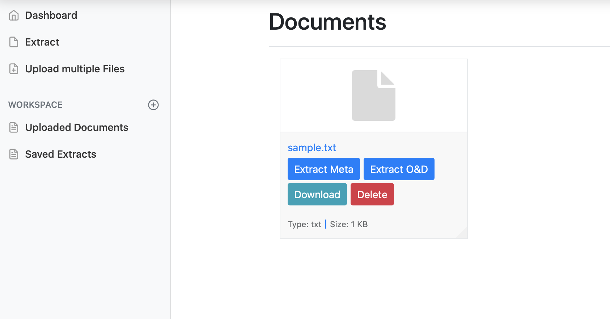
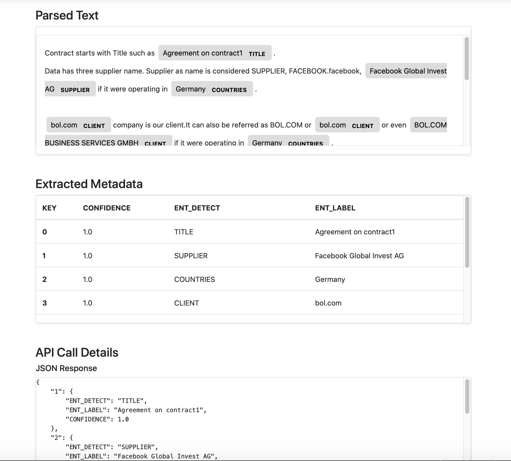

Creating a friendly Graphic user interface where a document is loaded and it generates three output

### a)- Displacy output for text parsing
### b)-Table showing key entities being extracted 
### c)-API response 

# Output

### Output from raw text

### Output from loaded test text file

