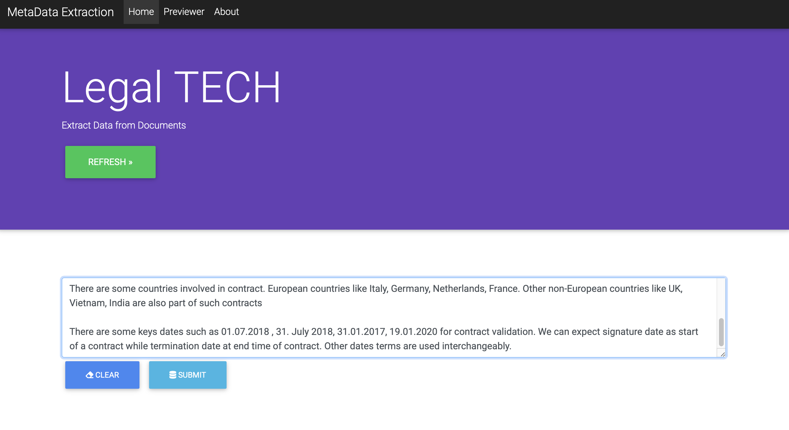
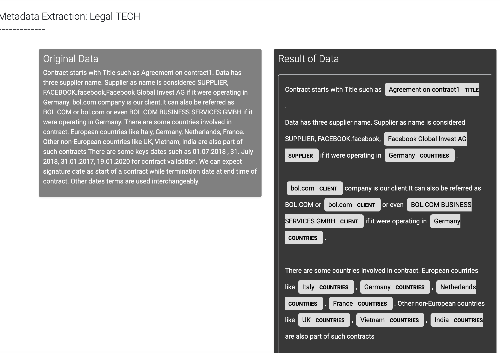

# Problem Statement

- Extracting key entities using flask

# Installation

Recommended start is miniconda (python 3.6).
Install dependencies with:
```bash
conda install flask numpy gensim pandas spacy 
conda install docx2txt 
```
**gensim** is optional and needed only if you use topic modeling or word2vec models.
- Don't forget to python -m spacy download en to install the spaCy language pack.

# How to Run app

```bash
python3 app.py
```
# API

/api/Text [GET]
Text should be submitted as phrase key (/api/phrase?phrase=)
```bash
[{"raw text": "Facebook is our supplier and bol.com is client in this example".}]
```
/api/deliverable [POST]
Expects a raw text, .docx, .txt,.pdf file object, returns html with sentences and highlighted entities:
```bash
[{"Text":"Facebook is our supplier and bol.com is client in this example", {"entity":"Facebook"},"label":"Supplier"}]
```
# Results
### Input



### Output


